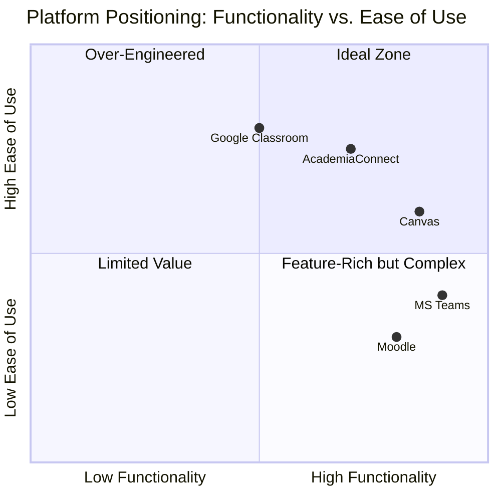

# Benchmark Analysis

## Comparative Analysis of Existing Systems

To inform the design of AcademiaConnect, we conducted a benchmark analysis of existing learning management and academic networking platforms.

---

## Systems Analyzed

### 1. Moodle

**Overview**: Open-source LMS widely used by universities

**Strengths**:
- ✅ Comprehensive course management
- ✅ Assignment submission and grading
- ✅ Quiz and assessment tools
- ✅ Plugin ecosystem

**Weaknesses**:
- ❌ Poor user interface (outdated design)
- ❌ Limited social networking features
- ❌ Single-institution focus
- ❌ No real-time chat
- ❌ Complex for basic notice distribution

**Relevance to AcademiaConnect**: Shows need for better UI/UX and social features

---

### 2. Google Classroom

**Overview**: Cloud-based LMS by Google

**Strengths**:
- ✅ Clean, intuitive interface
- ✅ Integration with Google Workspace
- ✅ Simple assignment workflow
- ✅ Mobile apps available

**Weaknesses**:
- ❌ Requires Google account
- ❌ Limited to single institution/class
- ❌ No cross-platform communication
- ❌ Basic social features only
- ❌ No notice aggregation from other systems

**Relevance to AcademiaConnect**: Good UI reference, but lacks multi-platform integration

---

### 3. Microsoft Teams (Education)

**Overview**: Collaboration platform adapted for education

**Strengths**:
- ✅ Excellent real-time communication (chat, video)
- ✅ File sharing and collaboration
- ✅ Integration with Office 365
- ✅ Team-based organization

**Weaknesses**:
- ❌ Overkill for simple notice distribution
- ❌ Steep learning curve
- ❌ Resource-intensive
- ❌ No multi-university aggregation
- ❌ Expensive for institutions

**Relevance to AcademiaConnect**: Shows value of integrated communication tools

---

### 4. Canvas LMS

**Overview**: Modern, cloud-based LMS

**Strengths**:
- ✅ Modern, responsive design
- ✅ Mobile-friendly
- ✅ Good API for integrations
- ✅ Rich feature set

**Weaknesses**:
- ❌ Expensive licensing
- ❌ Single-institution deployment
- ❌ Limited peer-to-peer features
- ❌ No cross-platform notice aggregation

**Relevance to AcademiaConnect**: API integration approach is instructive

---

### 5. Edmodo

**Overview**: Social learning platform for K-12 and higher ed

**Strengths**:
- ✅ Social network-like interface
- ✅ Easy to use
- ✅ Parent/guardian access (K-12 focus)
- ✅ Free tier available

**Weaknesses**:
- ❌ Primarily K-12 focused
- ❌ Limited university-level features
- ❌ No LMS integration
- ❌ Shutting down (as of 2022)

**Relevance to AcademiaConnect**: Social-first approach aligns with our vision

---

## Feature Comparison Matrix

| Feature | Moodle | Google Classroom | MS Teams | Canvas | AcademiaConnect |
|---------|--------|------------------|----------|---------|-----------------|
| **Multi-University** | ❌ | ❌ | ❌ | ❌ | ✅ |
| **Notice Aggregation** | ❌ | ❌ | ❌ | ❌ | ✅ |
| **Real-time Chat** | ⚠️ Plugin | ❌ | ✅ | ⚠️ Limited | ✅ |
| **Social Network** | ❌ | ⚠️ Basic | ⚠️ Basic | ❌ | ✅ |
| **Notes Sharing** | ⚠️ Per-course | ⚠️ Per-class | ✅ | ⚠️ Per-course | ✅ University-wide |
| **Mobile Responsive** | ⚠️ | ✅ | ✅ | ✅ | ✅ |
| **Free/Low-Cost** | ✅ OSS | ✅ Free | ⚠️ Paid | ❌ Expensive | ✅ MVP Free |
| **SSO Integration** | ✅ | ⚠️ Google only | ✅ | ✅ | ✅ |

---

## Key Differentiators

### What Makes AcademiaConnect Unique?

1. **Multi-University Focus**: Only platform designed for cross-institutional networking
2. **Aggregation-First**: Pulls from existing systems rather than replacing them
3. **Social-Academic Hybrid**: Balances LMS functionality with social networking
4. **Supplementary, Not Replacement**: Works alongside existing ELMS platforms

---

## Gaps Identified in Existing Systems

### Communication Gaps

!!! warning "Current State"
    - Students must use multiple platforms for communication (email, LMS messaging, personal chat apps)
    - No unified inbox for academic communication
    - Difficult to connect with peers from different universities or departments

**AcademiaConnect Solution**: Single platform for all academic communication with cross-institutional reach

---

### Information Fragmentation

!!! warning "Current State"
    - Notices scattered across ELMS, email, university websites, department boards
    - Students miss important announcements
    - No single source of truth for academic updates

**AcademiaConnect Solution**: Centralized timeline aggregating all sources

---

### Resource Sharing Limitations

!!! warning "Current State"
    - Notes and materials siloed by course and semester
    - Duplication of effort in note-taking
    - No way to discover quality resources from other sections/cohorts

**AcademiaConnect Solution**: University-wide searchable notes repository

---

### Collaboration Barriers

!!! warning "Current State"
    - Limited tools for peer-to-peer collaboration
    - Difficult to form study groups across institutions
    - No academic social graph

**AcademiaConnect Solution**: Friend network and chat features designed for academic collaboration

---

## Lessons Learned from Benchmark Analysis

### What to Adopt

1. **Clean UI (from Google Classroom)**: Prioritize simplicity and intuitiveness
2. **Real-time Features (from MS Teams)**: WebSocket-based chat is essential
3. **API-First (from Canvas)**: Robust APIs enable integrations
4. **Mobile-First (from all modern systems)**: Responsive design is non-negotiable

### What to Avoid

1. **Feature Bloat (from Moodle)**: Focus on core value proposition, don't try to do everything
2. **Vendor Lock-in (from MS/Google)**: Open standards and multiple SSO options
3. **High Cost (from Canvas)**: Keep MVP free, monetize thoughtfully later
4. **Complex Onboarding (from Moodle)**: Minimize friction for new users

---

## Competitive Positioning

**Target**: High ease of use with focused functionality (Quadrant 1)

---

!!! success "Strategic Insight"
    The benchmark analysis confirms that **no existing platform serves the cross-institutional academic networking niche**. AcademiaConnect fills a genuine gap in the market by focusing on aggregation and collaboration rather than attempting to replace comprehensive LMS functionality.
