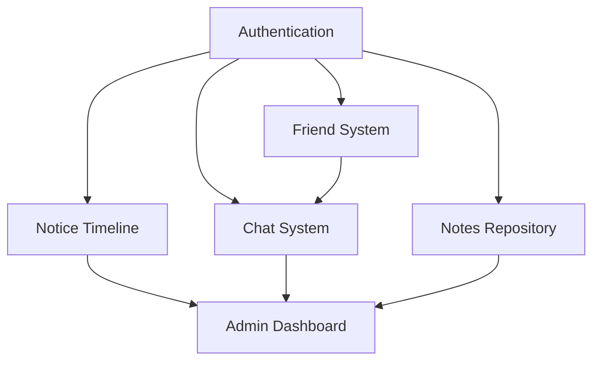

# Feature List Fixation

## MVP Feature Set

Based on requirements analysis, gap analysis, and survey results, the following features have been selected for the Minimum Viable Product (MVP).

---

## Core Features (Must Have - P0)

### 1. User Authentication & Authorization

**Priority**: P0 (Critical)

**Features**:
- SSO integration (SAML/OAuth2) with university systems
- Local account creation (email/password) as fallback
- Email verification for local accounts
- Password reset functionality
- Role-based access control (Student, Faculty, Admin)
- Secure session management (JWT tokens)

**User Stories**:
- As a student, I can log in using my university credentials
- As a faculty member, I can access my role-specific dashboard after authentication
- As a user, I can reset my password if I forget it

---

### 2. Centralized Notice Timeline

**Priority**: P0 (Critical)

**Features**:
- Display notices from multiple universities in chronological order
- Pull notices from ELMS APIs automatically
- Manual notice posting by faculty/admin
- Filter by university, department, course
- Search notices by keyword
- Category tags (assignment, event, announcement, deadline)
- Bookmark/save important notices

**User Stories**:
- As a student, I can see all my university notices in one place
- As a student, I can filter notices by my enrolled courses
- As a faculty member, I can post a notice to my course sections

---

### 3. One-to-One Chat System

**Priority**: P0 (Critical)

**Features**:
- Real-time text messaging via WebSocket
- Message history persistence
- Message search
- Online/offline status indicators
- Typing indicators
- File attachments (images, documents)
- Read/delivery receipts

**User Stories**:
- As a student, I can message a classmate about an assignment
- As a student, I can view my message history with any friend
- As a faculty member, I can respond to student questions via chat

---

### 4. Friend Request System

**Priority**: P0 (Critical)

**Features**:
- Send friend requests to other users
- Accept/reject friend requests
- View friend list
- Basic profile visibility controls
- Unfriend capability
- Search users by name or email

**User Stories**:
- As a student, I can send a friend request to my classmate
- As a student, I can accept or reject incoming friend requests
- As a student, I can view my list of friends

---

### 5. Notes Repository

**Priority**: P0 (Critical)

**Features**:
- Upload documents (PDF, DOCX, PPTX, max 20MB)
- Tag notes with course code, topic, semester
- Search notes by title, tags, course
- Preview documents before downloading
- Download notes
- Track upload date and author
- Basic moderation (approve/reject uploads)

**User Stories**:
- As a student, I can upload my notes to share with others
- As a student, I can search for notes on a specific course
- As a faculty member, I can moderate notes uploaded for my course

---

### 6. Admin Dashboard (Basic)

**Priority**: P0 (Critical)

**Features**:
- User management (view, edit, deactivate users)
- ELMS integration configuration
- Content moderation queue
- Basic system analytics (user counts, notice counts)
- Role assignment

**User Stories**:
- As an admin, I can configure API credentials for ELMS integration
- As an admin, I can view flagged content for moderation
- As an admin, I can assign roles to users

---

## Secondary Features (Should Have - P1)

### 7. Advanced Notice Filtering

**Priority**: P1 (High)

**Features**:
- Filter by date range
- Filter by priority level
- Filter by category
- Custom filter presets
- "My Courses" automatic filter

---

### 8. Notes Rating System

**Priority**: P1 (High)

**Features**:
- Rate notes 1-5 stars
- Optional text review
- Sort notes by rating
- Flag inappropriate content

---

### 9. Notification System

**Priority**: P1 (High)

**Features**:
- In-app notifications
- Email notifications (digest option)
- Notification preferences per category
- Mark as read/unread

---

### 10. Profile Management

**Priority**: P1 (High)

**Features**:
- Edit profile information
- Upload profile picture
- Set privacy preferences
- View own activity history

---

## Nice-to-Have Features (Could Have - P2)

### 11. Read Receipts (Chat)

**Priority**: P2 (Medium)

**Features**:
- Show when messages are delivered
- Show when messages are read
- Option to disable read receipts

---

### 12. Suggested Friends

**Priority**: P2 (Medium)

**Features**:
- Algorithm suggests friends based on:
  - Same courses
  - Same department
  - Mutual friends
  - Similar interests (based on notes viewed)

---

### 13. Advanced Admin Analytics

**Priority**: P2 (Medium)

**Features**:
- User engagement metrics
- Popular notes/courses
- Chat activity statistics
- ELMS sync success rates
- Export reports to PDF/CSV

---

### 14. Dark Mode

**Priority**: P2 (Medium)

**Features**:
- Toggle between light and dark themes
- Persist preference
- Automatic switching based on time

---

## Future Enhancements (Won't Have in MVP - P3)

### 15. Group Chat

**Priority**: P3 (Future)

**Features**:
- Create group chats
- Add/remove members
- Group admins
- File sharing in groups

---

### 16. Video/Audio Calling

**Priority**: P3 (Future)

**Features**:
- One-to-one video calls
- One-to-one audio calls
- Screen sharing

---

### 17. AI Recommendations

**Priority**: P3 (Future)

**Features**:
- Recommend notes based on courses
- Suggest study partners
- Predict assignment deadlines
- Content summarization

---

### 18. Mobile Native Apps

**Priority**: P3 (Future)

**Features**:
- iOS application
- Android application
- Push notifications
- Offline mode

---

### 19. Events and Calendar

**Priority**: P3 (Future)

**Features**:
- University events calendar
- Add events to personal calendar
- RSVP to events
- Sync with Google Calendar

---

### 20. Clubs and Organizations

**Priority**: P3 (Future)

**Features**:
- Club pages
- Join/leave clubs
- Club announcements
- Event management for clubs

---

## Feature Dependencies

### Prerequisite Relationships

**Critical Path**: Authentication must be completed first, as all other features depend on it.

---

## Feature Prioritization Rationale

### Why This Order?

**P0 (Must Have)**:
- Core value proposition features
- Without these, the platform has no unique value
- Survey indicated highest user demand

**P1 (Should Have)**:
- Significantly improve user experience
- Not critical for launch but important for adoption
- Can be added in first post-MVP sprint

**P2 (Could Have)**:
- Polish and convenience features
- Nice to have but not essential
- Add based on user feedback

**P3 (Won't Have)**:
- Long-term vision features
- Require significant additional resources
- Better addressed in Phase 2/3

---

## MoSCoW Analysis

**Must Have**: 6 features (Auth, Timeline, Chat, Friends, Notes, Admin)  
**Should Have**: 4 features (Filters, Ratings, Notifications, Profiles)  
**Could Have**: 4 features (Read receipts, Suggestions, Analytics, Dark mode)  
**Won't Have (in MVP)**: 6 features (Groups, Video/Audio, AI, Mobile apps, Events, Clubs)

---

!!! success "Feature Set Finalized"
    This feature list has been reviewed and approved by the project team and supervisor. Any additions or changes will require formal change request process.
