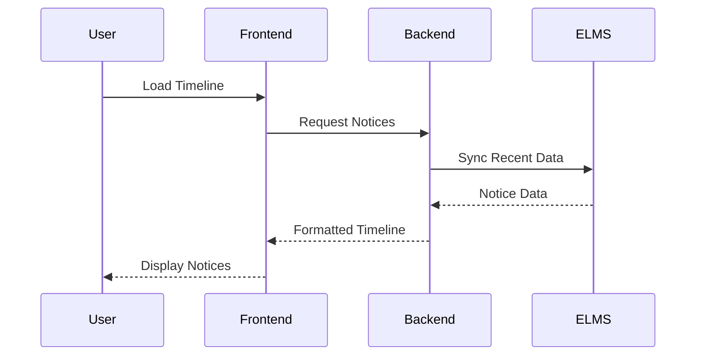

# Product Functions

## High-Level Function Overview

AcademiaConnect provides six primary function categories that work together to create a unified academic collaboration platform.

---

## 1. Centralized Notice Timeline & Filtering

### Purpose
Aggregate announcements from multiple universities and present them in a chronological, filterable timeline.

### Key Capabilities

- **Multi-Source Aggregation**: Pull notices from integrated ELMS APIs, RSS feeds, or manual admin posts
- **Real-time Updates**: New notices appear instantly via WebSocket connections
- **Advanced Filtering**: Filter by university, department, course, category (assignment, event, announcement)
- **Search Functionality**: Full-text search across notice titles and content
- **Personalization**: Subscribe to specific courses/departments for customized feed
- **Notification System**: Push notifications for high-priority announcements

### User Interactions



---

## 2. One-to-One Real-Time Chat

### Purpose
Enable direct, private communication between students and faculty.

### Key Capabilities

- **Real-time Messaging**: Instant message delivery via WebSocket
- **Message History**: Persistent storage of all conversations
- **Rich Media Support**: Send text, images, and file attachments
- **Typing Indicators**: Show when the other party is composing a message
- **Read Receipts**: Delivery and read status for each message
- **Online Status**: Display user availability
- **Search History**: Find past conversations by keyword or date

### Technical Implementation

- Backend: Socket.IO for WebSocket management
- Storage: PostgreSQL for message persistence
- Files: S3 storage for attachments with temporary signed URLs

---

## 3. Friend Management & Networking

### Purpose
Build academic social networks and manage peer connections.

### Key Capabilities

- **Friend Requests**: Send, receive, accept, or reject connection requests
- **Friend List Management**: View and organize connections
- **Profile Visibility**: Control who can see your profile and academic information
- **Suggested Connections**: Algorithm-based friend suggestions (future)
- **Mutual Friends**: Display shared connections
- **Activity Updates**: See friends' academic activities (opt-in)

### Request Workflow

1. User A sends friend request to User B
2. User B receives notification
3. User B can accept, reject, or ignore
4. If accepted, both users appear in each other's friend list
5. Chat becomes available between friends

---

## 4. Notes Repository with Tagging & Search

### Purpose
Create a centralized, searchable database of academic materials.

### Key Capabilities

- **Document Upload**: Support for PDF, DOCX, PPTX, TXT formats (max 20MB)
- **Metadata Tagging**: Tag notes by course code, topic, semester, professor
- **Full-Text Search**: Search across file names, descriptions, and indexed content
- **Preview Function**: View document preview before downloading
- **Download Tracking**: Analytics on popular notes and usage patterns
- **Rating System**: Users can rate note quality (1-5 stars)
- **Attribution**: Automatic credit to uploader with timestamp

### Search Algorithm

```
Search Priority:
1. Exact course code match (e.g., "CSE-3411")
2. Title keyword match
3. Tag match
4. Full-text content match
5. Author name match

Results sorted by:
- Relevance score
- Upload date (recent first)
- User ratings
```

---

## 5. Authentication & Authorization

### Purpose
Secure access control with support for institutional Single Sign-On.

### Key Capabilities

#### Authentication Methods

1. **SSO Integration** (Primary)
   - SAML 2.0 for university identity providers
   - OAuth2 for third-party authentication
   - LDAP for directory services
   - Automatic profile creation on first login

2. **Local Accounts** (Fallback)
   - Email/password registration
   - Email verification required
   - Password reset via email
   - Two-factor authentication (future)

#### Authorization Levels

| Role | Permissions |
|------|-------------|
| **Student** | View timeline, chat, upload/download notes, manage friends |
| **Faculty** | All student permissions + post notices, moderate course content |
| **Admin** | All permissions + user management, system configuration, analytics |
| **Guest** | View public notices only (read-only) |

### Security Features

- JWT tokens for session management
- Role-based access control (RBAC)
- Secure password hashing (bcrypt/argon2)
- Rate limiting on authentication endpoints
- Automatic session timeout after 24 hours

---

## 6. Admin Portal & Analytics

### Purpose
Provide system administrators with tools for management, moderation, and insights.

### Key Capabilities

#### Integration Management
- Configure ELMS API connections
- Test and monitor integration health
- Set synchronization schedules
- View integration logs and errors

#### User Management
- Create, edit, deactivate user accounts
- Assign and modify roles
- Reset passwords
- View user activity logs

#### Content Moderation
- Review flagged notices or notes
- Remove inappropriate content
- Ban users violating policies
- Set content guidelines

#### Analytics Dashboard
- Total users, active users (daily/weekly/monthly)
- Notice engagement metrics
- Chat message volume
- Notes upload/download statistics
- System performance metrics (response times, uptime)
- Integration success rates

### Dashboard Views

=== "Overview"
    - Key metrics summary
    - Recent system alerts
    - Quick actions panel

=== "Users"
    - User list with search/filter
    - Registration trends graph
    - Active users by department

=== "Content"
    - Recent notices and notes
    - Flagged content queue
    - Most popular resources

=== "Integrations"
    - Connected ELMS status
    - Sync history and errors
    - API usage statistics

---

## Function Dependencies

### Critical Path Functions
Functions that must work for the system to be useful:

1. Authentication (users must be able to log in)
2. Notice Timeline (primary value proposition)
3. Database connectivity (all features depend on data persistence)

### Independent Functions
Functions that can operate independently:

- Chat System (works without ELMS integration)
- Notes Repository (standalone knowledge base)
- Friend Management (internal social graph)

### Interdependent Functions
Functions that enhance each other:

- Notice Timeline + Friend Management (see friends' activity)
- Chat + Friend Management (chat available after friend connection)
- Notes Repository + Notice Timeline (notices can reference shared notes)

---

## Function Priorities (MVP)

### Must Have (P0)
- ✅ User authentication (SSO + local)
- ✅ Notice timeline with basic filtering
- ✅ One-to-one chat with message history
- ✅ Notes upload and download

### Should Have (P1)
- ✅ Friend request system
- ✅ Advanced notice filtering
- ✅ Notes search functionality
- ✅ Admin dashboard basics

### Nice to Have (P2)
- ⏳ Read receipts for chat
- ⏳ Notes rating system
- ⏳ Suggested friends algorithm
- ⏳ Advanced analytics

### Future Enhancements (P3)
- 🔮 Group chat and channels
- 🔮 Video/audio calling
- 🔮 AI content recommendations
- 🔮 Mobile push notifications

---

!!! info "Function Evolution"
    As the platform matures, functions will be enhanced based on user feedback and usage analytics. The modular architecture allows for incremental improvements without disrupting existing functionality.
