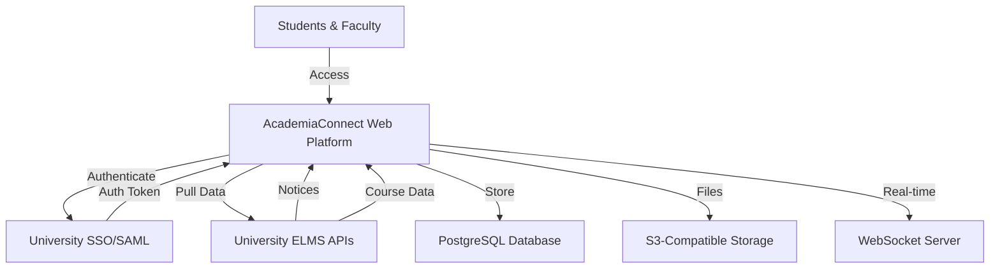

# Product Perspective

## System Context

AcademiaConnect operates as a **standalone web application** that functions as a middleware layer between students, faculty, and existing university systems. It is not a replacement for Learning Management Systems but rather a complementary platform that adds value through aggregation and enhanced collaboration features.

---

## System Architecture Overview



---

## System Positioning

### Relationship to Existing Systems

AcademiaConnect sits **between users and institutional systems**, acting as:

#### 1. **Aggregation Layer**
- Pulls notices and announcements from multiple university ELMS platforms
- Consolidates information from disparate sources into a unified view
- Does not store original institutional data, only references and metadata

#### 2. **Enhancement Layer**
- Adds social networking features (friends, chat) not present in traditional LMS
- Provides cross-institutional collaboration tools
- Enables peer-to-peer resource sharing (notes repository)

#### 3. **Integration Hub**
- Connects to universities via secure APIs where available
- Supports multiple authentication protocols (SAML, OAuth2, LDAP)
- Designed for extensibility to accommodate different institutional systems

---

## System Boundaries

### What the System Owns

!!! success "Direct Responsibilities"
    - User profiles and social connections (friend relationships)
    - Chat messages and communication history
    - Uploaded notes and documents in the repository
    - User preferences and customization settings
    - System analytics and usage logs

### What the System References

!!! info "External Data"
    - University notices and announcements (cached copies with attribution)
    - Course listings and metadata
    - User authentication credentials (validated through SSO)
    - ELMS assignment deadlines and events (synchronized periodically)

### What the System Does NOT Handle

!!! warning "Out of Scope"
    - Grade calculations or gradebook management
    - Assignment submission and evaluation
    - Course enrollment or registration
    - Financial transactions or fee management
    - Video content hosting or streaming

---

## Integration Model

### Primary Integration Points

#### University ELMS Systems

**Integration Method**: REST APIs, RSS feeds, or scheduled data exports

**Data Flow**: One-way pull (from ELMS to AcademiaConnect)

**Frequency**: 
- Notices: Every 15 minutes or via webhooks
- Course data: Daily synchronization
- User authentication: Real-time via SSO

**Example**: UCAM ELMS (UIU)
```
UCAM ELMS --> API/Feed --> AcademiaConnect
    - Notices endpoint
    - Course listings
    - Department structure
```

---

#### Authentication Systems

**Integration Method**: SAML 2.0, OAuth2, or LDAP

**Data Flow**: Bidirectional for authentication handshake

**Features**:
- Single Sign-On (SSO) for seamless login
- Role mapping (student, faculty, admin)
- Automatic profile creation on first login
- Session management and token refresh

---

#### File Storage Services

**Integration Method**: S3-compatible API (AWS S3, MinIO, DigitalOcean Spaces)

**Purpose**: Store user-uploaded documents (notes, attachments)

**Features**:
- Scalable object storage
- Direct upload/download URLs
- Metadata storage in PostgreSQL
- CDN integration for fast delivery

---

## System Independence

While AcademiaConnect integrates with external systems, it is designed to:

### Maintain Functional Independence
- Core features (chat, notes, friend management) work without ELMS integration
- Users can create local accounts if university SSO is unavailable
- System continues to function if one university's API is down

### Provide Graceful Degradation
- Cached notices remain accessible during integration outages
- Manual notice posting by admins as fallback
- Local authentication if SSO is temporarily unavailable

---

## Target Deployment Model

### Infrastructure

=== "Development Environment"
    - Local development servers
    - SQLite database for rapid prototyping
    - Mock ELMS APIs for testing
    - Localhost with hot-reloading

=== "Staging Environment"
    - Cloud-hosted VM (DigitalOcean, AWS EC2)
    - PostgreSQL database
    - Sandbox ELMS integrations
    - HTTPS with test certificates

=== "Production Environment"
    - Load-balanced cloud infrastructure
    - Managed PostgreSQL (AWS RDS, DigitalOcean Managed DB)
    - CDN for static assets
    - Full SSL/TLS encryption
    - Automated backups and monitoring

---

### Scalability Considerations

The system is designed to scale horizontally:

- **Web/App Servers**: Multiple instances behind load balancer
- **Database**: Read replicas for query performance
- **File Storage**: Distributed object storage (S3)
- **Real-time Chat**: Clustered WebSocket servers with Redis pub/sub

**Initial Capacity**: 10,000 concurrent users
**Scaling Target**: 50,000+ users with infrastructure upgrades

---

## User Access Model

### Access Channels

1. **Web Browser** (Primary)
   - Responsive design for desktop and mobile
   - Progressive Web App (PWA) capabilities for mobile experience
   - No installation required

2. **Mobile Browser** (Supported)
   - Optimized responsive layout
   - Touch-friendly interface
   - Reduced data usage mode

3. **Native Apps** (Future)
   - iOS and Android applications
   - Planned for Phase 2 post-MVP

---

## System Dependencies

### Critical Dependencies

!!! danger "Required for Operation"
    - Internet connectivity (no offline mode in MVP)
    - Modern web browser with JavaScript enabled
    - University cooperation for API access or data feeds
    - Email service for notifications (SendGrid, AWS SES)

### Optional Dependencies

!!! info "Enhanced Functionality"
    - WebSocket support for real-time chat (falls back to polling)
    - CDN for faster global content delivery
    - Analytics integration (Google Analytics, Mixpanel)
    - Error tracking (Sentry, Rollbar)

---

## Comparison with Traditional LMS

| Feature | Traditional LMS | AcademiaConnect |
|---------|----------------|-----------------|
| **Primary Purpose** | Course delivery & assessment | Networking & collaboration |
| **Scope** | Single institution | Multi-institution |
| **Assignment Submission** | ✅ Yes | ❌ No |
| **Grading** | ✅ Yes | ❌ No |
| **Social Features** | ❌ Limited | ✅ Extensive |
| **Cross-institutional** | ❌ No | ✅ Yes |
| **Real-time Chat** | ❌ Rare | ✅ Core feature |
| **Notes Sharing** | ⚠️ Per-course only | ✅ University-wide |

---

## Future Evolution

### Planned Expansions

**Phase 2 (6-12 months post-MVP)**:
- Native mobile applications
- Integration with additional LMS platforms (Canvas, Blackboard, Google Classroom)
- Video/audio communication
- Group chat and channels

**Phase 3 (1-2 years)**:
- AI-powered content recommendations
- Automated study group formation
- Advanced analytics dashboard for institutions
- API for third-party integrations

---

!!! tip "Design Philosophy"
    AcademiaConnect is built on the principle of **augmentation, not replacement**. We enhance what universities already have, filling gaps in social collaboration and cross-institutional networking without disrupting existing academic workflows.
