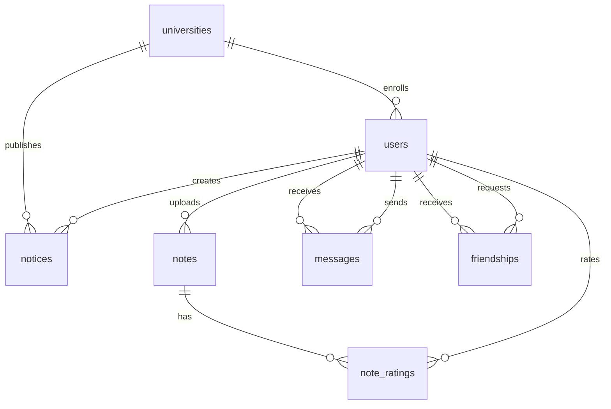

# Database Schema

## Entity-Relationship Overview

The AcademiaConnect database is designed using PostgreSQL with normalized tables to ensure data integrity and efficient querying.

---

## Core Tables

### User Table

Stores all user account information.

```sql
CREATE TABLE users (
    user_id SERIAL PRIMARY KEY,
    email VARCHAR(255) UNIQUE NOT NULL,
    password_hash VARCHAR(255),  -- NULL for SSO users
    name VARCHAR(100) NOT NULL,
    role VARCHAR(20) NOT NULL CHECK (role IN ('student', 'faculty', 'admin', 'guest')),
    university_id INT REFERENCES universities(university_id),
    department VARCHAR(100),
    profile_picture_url TEXT,
    is_active BOOLEAN DEFAULT TRUE,
    created_at TIMESTAMP DEFAULT CURRENT_TIMESTAMP,
    updated_at TIMESTAMP DEFAULT CURRENT_TIMESTAMP
);

CREATE INDEX idx_users_email ON users(email);
CREATE INDEX idx_users_university ON users(university_id);
CREATE INDEX idx_users_role ON users(role);
```

---

### University Table

Information about participating universities.

```sql
CREATE TABLE universities (
    university_id SERIAL PRIMARY KEY,
    name VARCHAR(200) NOT NULL,
    short_name VARCHAR(50),
    country VARCHAR(100),
    elms_api_url TEXT,
    elms_api_key VARCHAR(255),
    sso_provider VARCHAR(50),
    sso_config JSONB,
    created_at TIMESTAMP DEFAULT CURRENT_TIMESTAMP
);
```

---

### Notice Table

Stores academic notices and announcements.

```sql
CREATE TABLE notices (
    notice_id SERIAL PRIMARY KEY,
    title VARCHAR(255) NOT NULL,
    body TEXT NOT NULL,
    author_id INT REFERENCES users(user_id),
    university_id INT REFERENCES universities(university_id),
    department VARCHAR(100),
    course_code VARCHAR(50),
    target_scope VARCHAR(20) CHECK (target_scope IN ('university', 'department', 'course', 'public')),
    category VARCHAR(50) CHECK (category IN ('assignment', 'event', 'announcement', 'deadline')),
    priority VARCHAR(20) DEFAULT 'normal' CHECK (priority IN ('low', 'normal', 'high', 'urgent')),
    attachments JSONB,  -- Array of attachment URLs
    source VARCHAR(50) DEFAULT 'manual',  -- 'manual' or 'elms'
    source_id VARCHAR(255),  -- Original ID from ELMS if applicable
    is_published BOOLEAN DEFAULT TRUE,
    published_at TIMESTAMP,
    created_at TIMESTAMP DEFAULT CURRENT_TIMESTAMP,
    updated_at TIMESTAMP DEFAULT CURRENT_TIMESTAMP
);

CREATE INDEX idx_notices_university ON notices(university_id);
CREATE INDEX idx_notices_author ON notices(author_id);
CREATE INDEX idx_notices_published_at ON notices(published_at DESC);
CREATE INDEX idx_notices_category ON notices(category);
```

---

### Note Table

Repository of shared academic materials.

```sql
CREATE TABLE notes (
    note_id SERIAL PRIMARY KEY,
    title VARCHAR(255) NOT NULL,
    description TEXT,
    file_url TEXT NOT NULL,
    file_name VARCHAR(255),
    file_size_bytes BIGINT,
    file_type VARCHAR(50),
    author_id INT REFERENCES users(user_id),
    university_id INT REFERENCES universities(university_id),
    department VARCHAR(100),
    course_code VARCHAR(50),
    semester VARCHAR(20),
    tags TEXT[],  -- Array of tags
    download_count INT DEFAULT 0,
    average_rating DECIMAL(3,2),  -- 0.00 to 5.00
    is_approved BOOLEAN DEFAULT FALSE,
    approved_by INT REFERENCES users(user_id),
    approved_at TIMESTAMP,
    created_at TIMESTAMP DEFAULT CURRENT_TIMESTAMP,
    updated_at TIMESTAMP DEFAULT CURRENT_TIMESTAMP
);

CREATE INDEX idx_notes_author ON notes(author_id);
CREATE INDEX idx_notes_course ON notes(course_code);
CREATE INDEX idx_notes_tags ON notes USING GIN(tags);
CREATE INDEX idx_notes_created ON notes(created_at DESC);
```

---

### Message Table

Stores chat messages between users.

```sql
CREATE TABLE messages (
    message_id SERIAL PRIMARY KEY,
    sender_id INT REFERENCES users(user_id),
    receiver_id INT REFERENCES users(user_id),
    content TEXT NOT NULL,
    attachment_url TEXT,
    attachment_type VARCHAR(50),
    is_read BOOLEAN DEFAULT FALSE,
    read_at TIMESTAMP,
    sent_at TIMESTAMP DEFAULT CURRENT_TIMESTAMP,
    created_at TIMESTAMP DEFAULT CURRENT_TIMESTAMP
);

CREATE INDEX idx_messages_sender ON messages(sender_id);
CREATE INDEX idx_messages_receiver ON messages(receiver_id);
CREATE INDEX idx_messages_sent_at ON messages(sent_at DESC);
CREATE INDEX idx_messages_conversation ON messages(sender_id, receiver_id, sent_at);
```

---

### Friendship Table

Manages friend connections between users.

```sql
CREATE TABLE friendships (
    friendship_id SERIAL PRIMARY KEY,
    requester_id INT REFERENCES users(user_id),
    requestee_id INT REFERENCES users(user_id),
    status VARCHAR(20) CHECK (status IN ('pending', 'accepted', 'rejected', 'blocked')),
    requested_at TIMESTAMP DEFAULT CURRENT_TIMESTAMP,
    responded_at TIMESTAMP,
    created_at TIMESTAMP DEFAULT CURRENT_TIMESTAMP,
    UNIQUE(requester_id, requestee_id)
);

CREATE INDEX idx_friendships_requester ON friendships(requester_id);
CREATE INDEX idx_friendships_requestee ON friendships(requestee_id);
CREATE INDEX idx_friendships_status ON friendships(status);
```

---

## Supporting Tables

### Rating Table

User ratings for notes.

```sql
CREATE TABLE note_ratings (
    rating_id SERIAL PRIMARY KEY,
    note_id INT REFERENCES notes(note_id) ON DELETE CASCADE,
    user_id INT REFERENCES users(user_id),
    rating INT CHECK (rating >= 1 AND rating <= 5),
    review TEXT,
    created_at TIMESTAMP DEFAULT CURRENT_TIMESTAMP,
    UNIQUE(note_id, user_id)
);
```

---

### Session Table

User session management (optional, can use Redis instead).

```sql
CREATE TABLE sessions (
    session_id VARCHAR(255) PRIMARY KEY,
    user_id INT REFERENCES users(user_id),
    token TEXT NOT NULL,
    expires_at TIMESTAMP NOT NULL,
    created_at TIMESTAMP DEFAULT CURRENT_TIMESTAMP
);

CREATE INDEX idx_sessions_user ON sessions(user_id);
CREATE INDEX idx_sessions_expires ON sessions(expires_at);
```

---

### Audit Log Table

Track important system events for security and debugging.

```sql
CREATE TABLE audit_logs (
    log_id SERIAL PRIMARY KEY,
    user_id INT REFERENCES users(user_id),
    action VARCHAR(100) NOT NULL,
    entity_type VARCHAR(50),
    entity_id INT,
    details JSONB,
    ip_address INET,
    user_agent TEXT,
    created_at TIMESTAMP DEFAULT CURRENT_TIMESTAMP
);

CREATE INDEX idx_audit_user ON audit_logs(user_id);
CREATE INDEX idx_audit_created ON audit_logs(created_at DESC);
```

---

## Relationships Summary



---

## Data Types and Constraints

### Enumerated Types

Role: `student`, `faculty`, `admin`, `guest`

Notice Category: `assignment`, `event`, `announcement`, `deadline`

Priority: `low`, `normal`, `high`, `urgent`

Friendship Status: `pending`, `accepted`, `rejected`, `blocked`

---

## Indexes Strategy

**Performance Optimization**:
- Primary keys (automatic)
- Foreign keys for joins
- Frequently queried columns (university_id, created_at)
- Full-text search on notice body (not shown, requires tsvector)
- GIN index on tags array for efficient searching

---

!!! info "Schema Evolution"
    This schema represents the MVP design. Future versions may include additional tables for: group chats, notifications, events, clubs, and advanced analytics.
